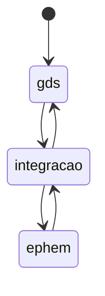
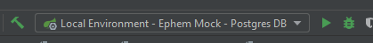

# Projeto de Integração GDS com EPHEM

Esta aplicação age como um middleware entre o aplicativo guardiões da saúde e o ephem.


## Subindo a aplicação localmente
### Pré-requisitos

- Java 11
- Docker e Docker Compose Instalados na máquina

### Configurando arquivos .env

Nas pastas [docker/db](docs/docker/db) e [docker/app](docs/docker/app) há um arquivo `.env.example` Faça uma cópia dos mesmos como valor `.env` e ajuste os valores.

Acesse a [pasta docker](docs/docker) e execute o comando `docker compose up -d`.

```bash
cd docker
docker-compose -f docker-compose-with-app.yml up -d
```

A imagem do banco de dados será construida a partir do arquivo [docker/db/Dockerfile](docs/docker/db/Dockerfile) 
e a versão do app de integração será baixado do [repositório público](https://hub.docker.com/repository/docker/gleytonlima/gds-ephem-integracao/general).

Utilize a [collection do postman](docs/gds2ephem.postman_collection.json) para executar requisições na aplicação.

Acesso a página de homologação do Ephem da UNB para verificar o resultado.

## Desenvolvimento

### Configure as variáveis de ambiente

Acesse a pasta [development-config](docs/development-config), crie uma copia do arquivo `.env.example` como `.env` e preencha os valores das variaveis de ambiente

Execute o arquivo loadenv.bat ou cadastre manualmente as variáveis de ambiente do arquivo .env na sua conta do windows

Faça o mesmo para a pasta [docker/db](docs/docker/db). Crie o arquivo `.env` a partir do exemplo e preencha os valores.

### Suba o container docker do banco de dados em Postgres

Para subir o banco de dados localmente acesse a [pasta docker](docs/docker) e execute:

```bash
cd docs/docker
docker-compose up -d
```

Clone este projeto e abra o Intellij. O projeto já vem com uma configuração pronta para ser usada:



Utilize a [collection do postman](docs/gds2ephem.postman_collection.json) para executar requisições na aplicação.

## Tecnologias utilizadas

- Java 11
- Spring Boot
- PostgreSQL
- JsonSchema

### Sobre o [JSON schema](https://json-schema.org/)

Neste projeto usamos o [JSON Schema](https://json-schema.org/) para validar os valores inputados via REST API.

O endpoint responsável por essa validação fica em /api-integracao/v1/templates. Atualize o schema para atualizar as regras de validação.
Um schema inicial é criado para a criação de um signal no Ephem.

## Documentação da Api

Ao subir a aplicação localmente a documentação da API estará disponível em: http://localhost:8080/api-integracao/v1/swagger-ui/#/