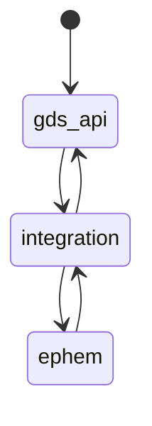
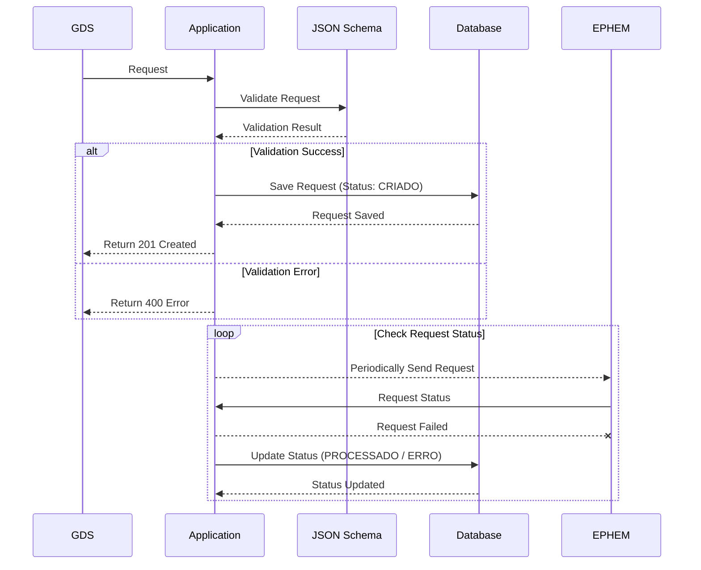

# Guardians of Health Integration Project - GDS with EPHEM

[](https://github.com/GleytonLima/gds-ephem-integracao/actions/workflows/build_and_publish.yaml) [](https://github.com/GleytonLima/gds-ephem-integracao/actions/workflows/build_and_publish.yaml)

This application acts as a middleware between the Guardians of Health application and EPHEM.



## API Documentation

https://vbeapi.online/api-integracao/v1/swagger-ui/#/

## Running the Application Locally

### Prerequisites

- Java 11
- Docker and Docker Compose Installed on your machine

### Configuring .env Files

In the folders [docker/db](docker/db) and [docker/app](docker/app), there is a `.env.example` file. Make a copy of each
as a `.env` file and adjust the values.

On root folder, execute the following command:

```bash
docker-compose -f docker-compose-with-app.yml up -d
```

The database image will be built from the [docker/db/Dockerfile](docker/db/Dockerfile) file, and the integration app
version will be downloaded from
the [public repository](https://hub.docker.com/repository/docker/gleytonlima/gds-ephem-integracao/general).

Use the [Postman collection](docs/gds2ephem.postman_collection.json) to make requests to the application.

Access the UNB EPHEM's staging page to check the results.

## Development

### Configure Environment Variables

Access the [development-config folder](docs/development-config), create a copy of the `.env.example` file as `.env`, and
fill in the environment variable values.

Execute the `loadenv.bat` file or manually set the environment variables from the .env file in your Windows account.

Do the same for the [docs/docker/db folder](docker/db). Create the `.env` file from the example and fill in the values.

### Launch the Postgres Docker Container

To run the database locally, execute the following command:

```bash
docker-compose -f docker-compose-db-only.yml up -d
```

Clone this project and open [Intellij IDE](https://www.jetbrains.com/idea/). The project comes with a pre-configured
setup for use:


Utilize the [Postman collection](docs/gds2ephem.postman_collection.json) to make requests to the application.

## Example of Deploying the Application

A complete example of deploying the application can be found in the
repository [gds-vbe-api](https://github.com/GleytonLima/gds-vbe-api).

## Technologies Used

- Java 11
- Spring Boot
- PostgreSQL
- JSON Schema

### About [JSON Schema](https://json-schema.org/)

In this project, we use [JSON Schema](https://json-schema.org/) to validate values input via REST API.

The endpoint responsible for this validation is located at /api-integracao/v1/templates. Update the schema to update the
validation rules. An initial schema is created for creating a signal in EPHEM.

## API Documentation

When running the application locally, the API documentation will be available
at: http://localhost:8080/api-integracao/v1/swagger-ui/#/

### Main Functionalities

Examples of requests can be found in the [Postman collection](docs/gds2ephem.postman_collection.json).

#### Update the template for creating a signal in EPHEM

This endpoint updates the template for creating a signal in EPHEM. The template is used to validate the request body.

Example of request using curl:

```bash
curl --location --request PUT 'https://vbeapi.online/api-integracao/v1/templates/1' \
--header 'Content-Type: application/json' \
--data-raw '{
    "inputEphemMap": {
        "general_hazard_id": {
            "from": [],
            "default_value": "0",
            "type": "integer"
        },
        "confidentiality": {
            "from": [],
            "default_value": "level_1",
            "type": "string"
        },
        "specific_hazard_id": {
            "from": [],
            "default_value": "0",
            "type": "integer"
        },
        "state_id": {
            "from": [
                "evento_estado_ocorrencia"
            ],
            "default_value": "0",
            "type": "model",
            "model_name": "res.country.state",
            "model_property_filter": "name"
        },
        "country_id": {
            "from": [
                "evento_pais_ocorrencia"
            ],
            "default_value": "0",
            "type": "model",
            "model_name": "res.country",
            "model_property_filter": "name"
        },
        "district_ids": {
            "from": [
                "evento_municipio_ocorrencia"
            ],
            "type": "model_array",
            "default_value": "@search('\''Nova Localidade'\'')",
            "model_name": "res.country.state.district",
            "model_property_filter": "name"
        },
        "signal_type": {
            "from": [],
            "default_value": "opening",
            "type": "string"
        },
        "report_date": {
            "from": [
                "evento_data_ocorrencia"
            ],
            "default_value": "@today",
            "type": "date",
            "from_format": "dd-MM-yyyy"
        },
        "incident_date": {
            "from": [
                "evento_data_ocorrencia"
            ],
            "default_value": "@today",
            "type": "date",
            "from_format": "dd-MM-yyyy"
        }
    },
    "outputEphemMap": {
        "status": {
            "from": ["signal_stage_state_id"],
            "default_value": "Em processamento",
            "type": "string"
        }
    },
    "definition": {
        "type": "object",
        "title": "Product",
        "$schema": "http://json-schema.org/draft-07/schema#",
        "required": [
            "general_hazard_id",
            "confidentiality",
            "specific_hazard_id",
            "country_id",
            "state_id",
            "district_ids",
            "signal_type",
            "report_date",
            "incident_date"
        ],
        "properties": {
            "state_id": {
                "type": "integer"
            },
            "country_id": {
                "type": "integer"
            },
            "report_date": {
                "type": "string",
                "format": "date"
            },
            "signal_type": {
                "enum": [
                    "opening",
                    "update",
                    "related"
                ],
                "type": "string"
            },
            "district_ids": {
                "type": "array",
                "items": {
                    "type": "integer"
                }
            },
            "incident_date": {
                "type": "string",
                "format": "date"
            },
            "confidentiality": {
                "enum": [
                    "level_5",
                    "level_4",
                    "level_3",
                    "level_2",
                    "level_1"
                ],
                "type": "string"
            },
            "general_hazard_id": {
                "type": "integer"
            },
            "specific_hazard_id": {
                "type": "integer"
            }
        },
        "description": "Esquema que representa um'\''signal'\''do Ephem(Odoo)"
    }
}'
```

For example, lets use the "state_id" field from "iputEphemMap". 

The "from" field contains the fields from the request
body that will be used to fill the "state_id" field. 

The "default_value" field contains the default value for the
"state_id" field. 

The "type" field contains the type of the "state_id" field. 

The "model_name" field contains the name
of the model that will be used to fill the "state_id" field. 

The "model_property_filter" field contains the name of the
field that will be used to filter the model. 

The "from_format" field contains the format of the date that will be used
to fill the "state_id" field.

#### Send a Event to EPHEM

This is the main functionality of the application. It receives a request from GDS and sends it to EPHEM.



The first step is to validate the request body against the JSON Schema. If the validation fails, the application returns
a 400 error with the validation errors.

If the validation is successful, the application saves the request in the database with status "CRIADO".

Posteriorly and periodically, the application will send the request to EPHEM. If the request is successful, the
application updates the request status to "PROCESSADO". Otherwise, the status is updated to "ERRO".

Example of request using curl:

```bash
curl --location 'http://localhost:8080/api-integracao/v1/eventos' \
--header 'Content-Type: application/json' \
--data-raw '{
    "eventoIntegracaoTemplate": "/1",
    "userId": 3,
    "userEmail": "novo@teste.com",
    "eventSourceId": 1,
    "eventSourceLocation": "comunidade B",
    "eventSourceLocationId": 1,
    "data": {
        "evento_descricao": "Duas ou mais pessoas doentes com sintomas parecidos",
        "evento_detalhes": "N",
        "evento_qtde_envolvidos": "apenas 1",
        "evento_afetados": "Ambiente",
        "evento_sabe_quando_ocorreu": "Sim",
        "evento_data_ocorrencia": "20-10-2023",
        "evento_local_ocorrencia": "Sobradinho",
        "evento_pais_ocorrencia": "Brasil",
        "evento_estado_ocorrencia": "Distrito Federal",
        "evento_municipio_ocorrencia": "Brasília"
    },
    "aditionalData": {
        "Tipo de Notificação": "Coletiva",
        "Tipo de Ocorrência": "Em Humanos",
        "Quantos Envolvidos": "Mais de 5"
    }
}'
```

#### List events

This endpoint lists all requests sent to EPHEM. The results are paginated.

Example of request using curl:

```bash
curl --location 'http://localhost:8080/api-integracao/v1/eventos?size=10&page=0&userId=3&sort=updatedAt%2Cdesc'
```

Example of response:

```json
{
  "_embedded": {
    "eventos": [
      {
        "id": 1,
        "data": {
          "evento_afetados": "Ambiente",
          "evento_detalhes": "N",
          "evento_descricao": "Duas ou mais pessoas doentes com sintomas parecidos",
          "evento_data_ocorrencia": "20-10-2023",
          "evento_pais_ocorrencia": "Brasil",
          "evento_qtde_envolvidos": "apenas 1",
          "evento_local_ocorrencia": "Sobradinho",
          "evento_estado_ocorrencia": "Distrito Federal",
          "evento_sabe_quando_ocorreu": "Sim",
          "evento_municipio_ocorrencia": "Brasília"
        },
        "aditionalData": {
          "Quantos Envolvidos": "Mais de 5",
          "Tipo de Ocorrência": "Em Humanos",
          "Tipo de Notificação": "Coletiva"
        },
        "status": "PROCESSADO",
        "statusMessage": "signal criado com suceso com id: 1",
        "signalId": 1,
        "eventSourceId": "1",
        "eventSourceLocation": "comunidade B",
        "eventSourceLocationId": 1,
        "userId": 3,
        "userEmail": "novo@teste.com",
        "createdAt": "2023-10-21T20:55:54.959986Z",
        "updatedAt": "2023-10-21T20:55:57.082972Z",
        "_links": {
          "self": {
            "href": "http://localhost:8080/api-integracao/v1/eventos/1"
          },
          "eventoIntegracao": {
            "href": "http://localhost:8080/api-integracao/v1/eventos/1"
          },
          "eventoIntegracaoTemplate": {
            "href": "http://localhost:8080/api-integracao/v1/eventos/1/eventoIntegracaoTemplate"
          }
        }
      }
    ]
  },
  "_links": {
    "self": {
      "href": "http://localhost:8080/api-integracao/v1/eventos?size=10&page=0&userId=3&sort=updatedAt,desc"
    },
    "profile": {
      "href": "http://localhost:8080/api-integracao/v1/profile/eventos"
    },
    "search": {
      "href": "http://localhost:8080/api-integracao/v1/eventos/search"
    }
  },
  "page": {
    "size": 10,
    "totalElements": 1,
    "totalPages": 1,
    "number": 0
  }
}
```

The "data" field contains the request data.

The "aditionalData" field contains the additional data.

The "status" field contains the status of sync with Ephem.

The "statusMessage" field contains the message returned by EPHEM.

The "signalId" field contains the signal id returned by EPHEM.

#### Get Signal associated with an Event

This endpoint returns the signal associated with an Event sent to EPHEM.

Example of request using curl:

```bash
curl --location 'https://vbeapi.online/api-integracao/v1/eventos/70/signals'
```

Example of response:

```json
{
  "_embedded": {
    "signals": [
      {
        "eventId": 70,
        "signalId": 6,
        "dados": {
          "signal_stage_state_id": [
            1,
            "Informado"
          ],
          "id": 6
        }
      }
    ]
  },
  "_links": {
    "self": {
      "href": "http://vbeapi.online/api-integracao/v1"
    }
  }
}
```

The "dados" field contains the signal data. The "signal_stage_state_id" field contains the signal status.

The possible values for the "signal_stage_state_id" field are:

| Id | Description |
| --- | --- |
| 1 | Informado |
| 2 | Em Análise |
| 3 | Descartado |
| 4 | Em Monitoramento |
| 5 | Evento |
| 6 | Encerrado |